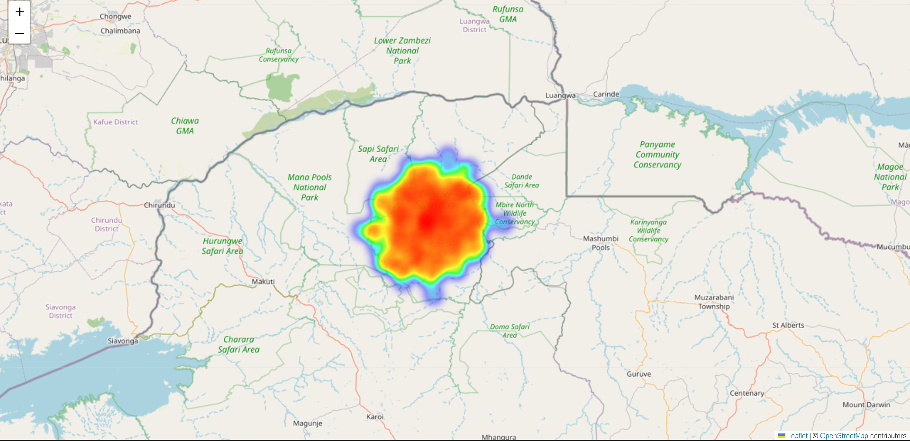

# Wildlife Anti-Poaching Operations & Tactical Intelligence Analytics

## 📌 Project Overview
This project simulates, preprocesses and analyzes tactical law enforcement and patrol planning logs within a managed conservation area. Operating similarly to industry-standard park management tools (such as SMART and EarthRanger), this script ingests messy raw field data, addresses missing observations, conducts time-series feature engineering and constructs an interactive geospatial heatmap. The ultimate goal is to isolate geographic threat hotspots and critical temporal windows to optimize ranger patrol deployment and resource allocation.

## 🛠️ Tech Stack & Skills Demonstrated
* **Languages:** Python
* **Libraries:** Pandas, NumPy, Folium (Geospatial Mapping), Matplotlib, Seaborn
* **Data Engineering & ETL:** Data Cleansing, Missing Value Imputation, Time-Series Component Extraction (Hour, Day, Shift-Mapping)
* **Intelligence Domain:** Operations Reporting, Geospatial Risk Analysis, Threat Matrix Evaluation

## 📊 Dataset & Field Processing (ETL)
The script models a high-density tactical log of 800 poaching-related incidents over a 60-day window. 
* **Data Cleaning:** Handled operational field-entry gaps by identifying and cleanly imputing missing environmental variables (`Weather_Condition`) as `"Unknown"`.
* **Feature Engineering:** Extracted temporal attributes from timestamps (`Hour_of_Day`, `Day_of_Week`) and mapped operational parameters to isolate high-risk night shifts.

## 📈 Tactical Intelligence Report Outcomes

Based on the processed historical field logs, the following actionable operational patterns were discovered:

* **Top High-Risk Sector:** **Sector Bravo** (360 incidents resolved) — This area represents the primary intelligence priority for physical interdictions, accounting for nearly half of all logged field events.
* **Night-time Illegal Activity Weight:** **67.25%** of all logged events occurred during the designated night patrol window (18:00 - 06:00), confirming that poachers heavily rely on low-light windows for cross-boundary movement.
* **Threat Matrix Breakdown:**
  * **Snare Detected:** 39.1% (Primary resource threat)
  * **Poacher Tracks:** 30.5% (Active ground incursions)
  * **Unauthorized Entry:** 19.5% (Boundary breaches)
  * **Carcass Found:** 10.9% (Critical impact events)

### Geospatial Hotspot Mapping Analytics
To enable tactical commanders to visually spot active incursions, the coordinates were parsed through a geospatial kernel density estimation map. The resulting interactive visual isolates intense spatial clusters where snare lines and illegal boundary crossings heavily overlap.

#### Key Spatial Observations from the Heatmap:
* **Primary Infiltration Corridor:** A critical high-density red zone is visibly concentrated around the central grid of the reserve, signifying a recurring entry path for poachers.
* **Boundary Aggregation:** Incidents in the highest-risk sector (Sector Bravo) heavily aggregate along a linear axis, strongly correlating with structural access points or natural river boundaries.
* **Patrol Optimization Area:** The sharp contrast between the dense red clusters and the wider green buffers highlights exactly where stationary camera traps or listening posts should be deployed to maximize coverage.



## 🚀 How to Run This Project Locally

1. **Clone the repository:**
   ```bash
   git clone https://github.com
   ```

2. **Install the required professional dependencies:**
   ```bash
   pip install pandas numpy folium
   ```

3. **Execute the intelligence engine script:**
   ```bash
   python wildlife_intelligence_analyst.py
   ```
   *Running the script prints the operational threat matrix to your terminal and auto-generates the interactive map file: `incident_hotspots_map.html`.*

## 🔮 Future Intelligence Roadmap
* **Predictive Classification Modeling:** Build an advanced machine learning classification model to predict the probability of an incident type based on current weather conditions and spatial proximity to boundaries.
* **Network Graph Analysis:** Integrate mock informant networks to link recurring spatial poaching locations back to common supply nodes or exit paths.
